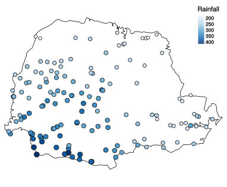
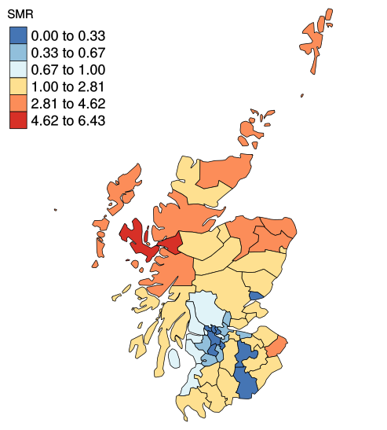
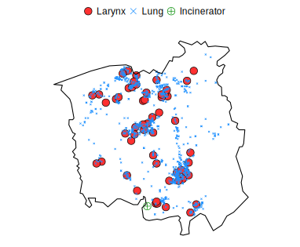
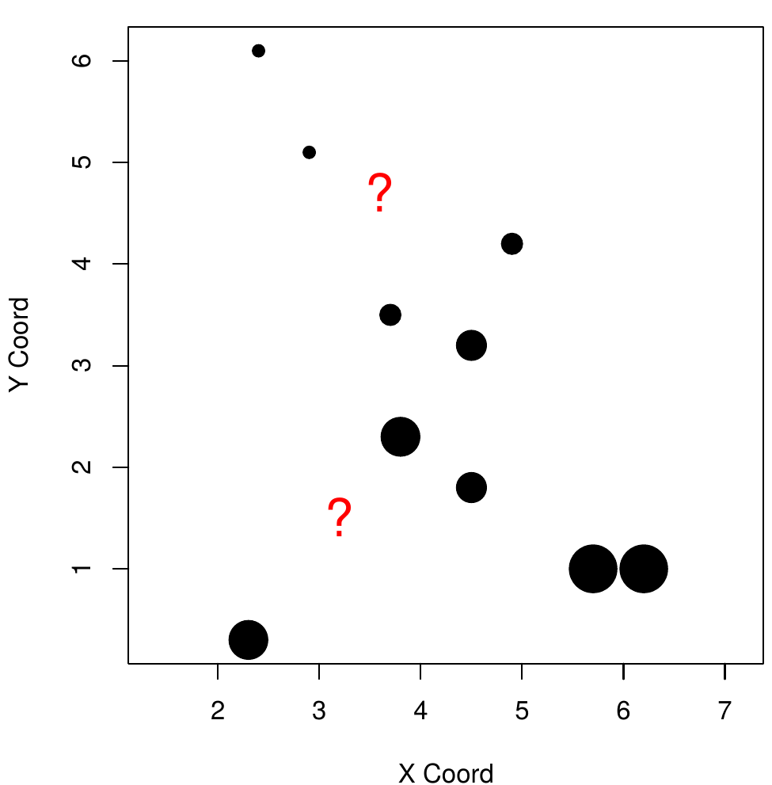

```{r setup, include=FALSE}
options(htmltools.dir.version = FALSE)
```

class: inverse, center, middle

# Introduction

---

# Taxonomies of spatial data

Spatial data are usually classified according to three main classes Cressie (1991):

* **Geostatistical data**

* **Point pattern data**

* **Areal data**

There are specific statistical analyses for each of these types of spatial data.  

---
class: inverse, center, middle

# Geostatistical data

---

# Geostatistical data

**Data that vary continuously over space, but is measured only at discrete locations.**

Consist of pairs of data $(Y_i, x_i)$, where 

- $Y_i$ is the value observed/measured at a fixred location $x_i$.
- $x_i = (x_{i1}, x_{i2})$ where $x_{i1}$ longitude (easting) and $x_{i2}$ is latitude (northing). 

Examples could be rainfall, temperature, soil characteristics.

---

# Example

```{r rainfall, echo=FALSE, out.width="70%", fig.align='center'}

```

**Fig. 1:** Average rainfall over different years for the period May-June collected at 143 recording stations throughout Parana state, Brasil. 

---
class: inverse, middle, center

# Areal data

---

# Areal data

**Similar to geostatistical data, but are aggregated to an area that can have a regular or irregular shape.** 

Consist of pairs of data $(Y_i, A_i)$, where 

- $Y_i$ is the value registered for the area $A_i$.
- $A_i$ is a specific area (polygon) in our study region. 

Examples include household income per zip-code, number of disease cases per county, state specific election results.


---

# Example

```{r lipcancer, echo=FALSE, out.width="50%", fig.align='center'}

```

**Fig. 2:** Standardised mortality ratio of lip cancer cases for the period 1975to 1986, for 56 districts in Scotland.

---
class: inverse, middle, center

# Point pattern data

---

# Point pattern data

**Consist of a set of locations $x_i$ of objects/events occurring in a study region.**

In this case we are usually more concerned with the presence/absence of an event rather than the value of the measurement at a point.
 
Examples could be trees in a forest, animal nets, crimes, domiciles of new cases of a certain disease.

---

# Example

```{r chorley, echo=FALSE, out.width="70%", fig.align='center'}

```

**Fig. 3:** Chorley-Ribble data. Spatial locations of cases of cancer of the larynx and the lung and a disused industrial incinerator.

---

# Taxonomies of spatial processes

A **stochastic process** is a collection of random variables

A **spatial stochastic process** is a stochastic process in which each random variable is associated with a position in space

Two important types of spatial stochastic process:

- **discrete spatial variation**: the random variables are defined on a finite set of locations. 

- **continuous spatial variation**: the random variables are defined on a continuous spatial region, $A\in \mathbb{R}^2$

---
class: inverse, middle, center

# Geostatistics

---

# Past vs. Present

&nbsp;

**Traditionally**, a self-contained methodology for spatial prediction:
- origins in the South African mining industry
- subsequently developed at École des Mines, Fontainebleau, France

&nbsp;

**Nowadays**, that part of spatial statistics which is concerned with data obtained by (spatial) sampling of continuous spatial phenomena.

  

---
# .font60[Model-based Geostatistics (Diggle, Moyeed and Tawn, 1998)]

**The application of general principles of statistical modelling and inference to geostatistical problems**

- formulate a model for the data (and for the process);

- use likelihood-based methods of inference;

- answer the scientific question.

---
# The canonical geostatistical probelm

Given a set of measurements $Y_i : i = 1,\ldots,n$ at locations $x_i$ in a spatial region $A$, presumed to be (noisy) measurements of a spatially continuous phenomenon $S(x_i)$, what can we say about the realisation of $S(x_i)$ throughout $A$?

```{r geo_problem, echo=FALSE, out.width="50%", fig.align='center'}

```

---
# Geostatistical problems more generally

<br/>

1. **Design:** how to chose locations $x_i$ at which to collect outcome data

2. **Estimation**: how to investigate relationship between outcome and covariates when data may be spatially correlated

3. **Prediction**: how to map (expected value of) outcome throughout the study-region.

<br/>

**Practical point**:

- Estimation only requires covariate information at locations $x_i$
- Prediction requires covariate information throughout the study-region.

---
# Empirical vs. Mecahnistic models

**Empirical:** models that acquire information from *data* and try to describe the observed data pattern.


**Mechanistic:** models aim to encapsulate the underlying scientific
processes that generated the data. Information is acquarire from *scientific contextual knowledge*.


If we merge them we can have  **mechanistically motivated statistical models**.

---

# .font60[Modelling prevalence of an infectious disease antibody]

$p(t)\rightarrow$  antibody prevalence at age $t$ with

$\lambda\rightarrow$ constant rate that controls the conversion to sero-positive

$\rho\rightarrow$ rate that controls the conversion from sero-positive to sero-negative

The mechanism of sero-conversion can be defined using the following differential equation:
$$\frac{dp}{dt}=\lambda \left\{1 - p(t)\right\} - \rho p(t)$$
whose solution is
$$p(t)=\frac{\lambda}{\lambda + \rho}[1-\exp{-(\lambda + \rho)t}]$$
--
Adding an empirical submodel for $\lambda$
$$\lambda_i=\exp(\alpha + \beta d_i+U_i)$$