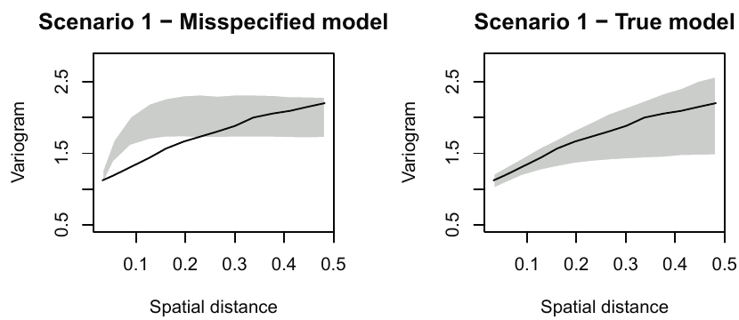
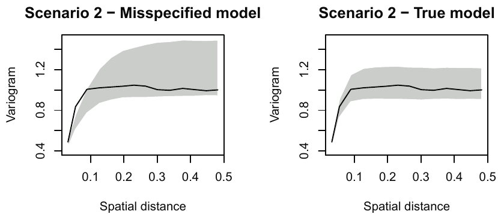
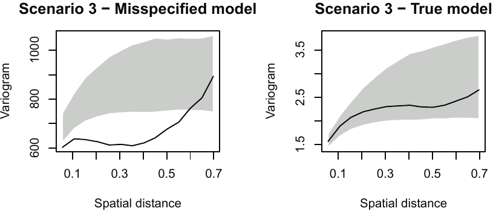

```{r setup, include=FALSE}
options(htmltools.dir.version = FALSE)
knitr::opts_chunk$set(cache = T)
```
class: inverse, center, middle

# Model formulation

---
# The linear geostatistical model

$$Y_i=d(x_i)^{\text{T}}\beta +S(x_i) + Z_i:i=1,\ldots,n$$

--
$Y_i$ observation at location $x_i$

--

$d(x_i)$ is a set of spatially indexed covariates

--

$S(x_i)$ spatial Gaussian process

- stationary and isotropic
- $Cov\{S(x), S(x^{\prime})\}=\sigma^2\rho(u;\phi)$

--

$Z_i$ uncorrelated $N(0, \tau^2)$

--

### .red[Assumption] 

Conditional on $S$, the $Y_i$ are .red[mutually independent]
$$[Y_i\mid S]\sim N(\alpha + d(x_i)^{\text{T}}\beta +S(x_i),\tau^2)$$

---
# Residual components of the model

$S(x_i)$ and $Z_i$ represent the variation in $Y_i$ that is not explained by the explanatory variables $d(x_i)$

--

- $S(x_i)$ explains .red[spatially structured] residual variation

--

- $Z_i$ explains any residual variation .red[without a structure]
dsadsa
---
# .font90[Covariance and correlation structure of] $Z_i$

$\tau^2=0.5$

```{r zmat,echo=FALSE, out.width='50%', fig.width=5,fig.height=5,fig.show='hold',fig.align='default'}
tau2 <- .5
n <- 10
Z <- diag(tau2, nrow = n, ncol = n)
colnames(Z) <- rownames(Z) <- paste0("Z", 1:n)

library(ggplot2)

longData1 <- reshape2::melt(Z)
ggplot(longData1, aes(x = Var2, y = forcats::fct_rev(Var1))) + 
  geom_tile(aes(fill = value), colour = "white") +
  scale_fill_gradient(low = "#ebf2ed", high = "#2f67d0", expression(Cov(Z[i],Z[j]))) +
  labs(x = "", y = "", title = "Covariance matrix") + 
  theme_classic() +
  theme(axis.line = element_blank(), axis.ticks = element_blank()) +
  coord_equal()

Zcor <- diag(1, nrow = n, ncol = n)
colnames(Zcor) <- rownames(Zcor) <- paste0("Z", 1:n)
longData2 <- reshape2::melt(Zcor)
ggplot(longData2, aes(x = Var2, y = forcats::fct_rev(Var1))) + 
  geom_tile(aes(fill = value), colour = "white") +
  scale_fill_gradient(low = "#ebf2ed", high = "#2f67d0", expression(Corr(Z[i],Z[j]))) +
  labs(x = "", y = "", title = "Corellation matrix") + 
  theme_classic() +
  theme(axis.line = element_blank(), axis.ticks = element_blank()) +
  coord_equal()
```

---
# .font80[Covariance and correlation structure of] $S(x_i)$

$\sigma^2=0.5~~~\phi = .15~~~\rho=\exp(-u/\phi)$

```{r smat,echo=FALSE, out.width='50%', fig.width=5,fig.height=5,fig.show='hold',fig.align='default'}
sigma2 <- .5
phi <- .15
n <- 10
library(geoR)
coords <- matrix(runif(n * 2), ncol = 2)
S <- varcov.spatial(coords, nugget = 0, cov.pars = c(sigma2, phi))$varcov
colnames(S) <- rownames(S) <- paste0("S", 1:n)

library(ggplot2)

longData1 <- reshape2::melt(S)
ggplot(longData1, aes(x = Var2, y = forcats::fct_rev(Var1))) + 
  geom_tile(aes(fill = value), colour = "white") +
  scale_fill_gradient(low = "#ebf2ed", high = "#2f67d0", expression(Cov(S[x[i]],S[x[j]]))) +
  labs(x = "", y = "", title = "Covariance matrix") + 
  theme_classic() +
  theme(axis.line = element_blank(), axis.ticks = element_blank()) +
  coord_equal()


longData2 <- longData1
longData2$value <- longData2$value / sigma2
ggplot(longData2, aes(x = Var2, y = forcats::fct_rev(Var1))) + 
  geom_tile(aes(fill = value), colour = "white") +
  scale_fill_gradient(low = "#ebf2ed", high = "#2f67d0", expression(Corr(S[x[i]], S[x[j]]))) +
  labs(x = "", y = "", title = "Correlation matrix") + 
  theme_classic() +
  theme(axis.line = element_blank(), axis.ticks = element_blank()) +
  coord_equal()
```

---
# .font80[Covariance and correlation structure of] $S(x_i)$

$\sigma^2=0.5~~~\phi = .15~~~\rho=\exp(-u/\phi)$

```{r dmat,echo=FALSE, out.width='50%', fig.width=5,fig.height=5,fig.show='hold',fig.align='default'}

ggplot(longData2, aes(x = Var2, y = forcats::fct_rev(Var1))) + 
  geom_tile(aes(fill = value), colour = "white") +
  scale_fill_gradient(low = "#ebf2ed", high = "#2f67d0", expression(Corr(S[x[i]], S[x[j]]))) +
  labs(x = "", y = "", title = "Correlation matrix") + 
  theme_classic() +
  theme(axis.line = element_blank(), axis.ticks = element_blank()) +
  coord_equal()

distS <- as.matrix(dist(coords))
colnames(distS) <- rownames(distS) <- paste0("x", 1:n)
longData2 <- reshape2::melt(distS)
ggplot(longData2, aes(x = Var2, y = forcats::fct_rev(Var1))) + 
  geom_tile(aes(fill = value), colour = "white") +
  scale_fill_gradient(low = "#ebf2ed", high = "#2f67d0", expression(u(x[i],x[j]))) +
  labs(x = "", y = "", title = "Distance matrix") + 
  theme_classic() +
  theme(axis.line = element_blank(), axis.ticks = element_blank()) +
  coord_equal()
```

---
# A hierarchical modelling framework

**Need to distinguish between:**

- .red[scientific] modelling of a process whose behavior we wish to understand
- .red[statistical] modelling of data that tell us something about the process

--

**A general framework:** 

- $S\rightarrow$ the scientific process we wish to understand (.red[signal])
- $Y\rightarrow$ data that can help us understand the process (.red[noise])

--

**Hierarchical formulation:**($[\cdot]$ means *the distribution of*)

$$[Y, S]=[Y\mid S][S]$$

--

$$[Y, S; \theta]=[Y\mid S; \theta][S; \theta]$$
with $\theta = (\beta, \sigma^2, \phi, \tau^2)$.

---
class: inverse, center, middle

# Inference

---
# Likelihood 

**The likelihood function** of a statistical model is the joint probability distribution of the data considered as a function of the parameters.

--

It follows that, if we start from our hierarchical specification of our model 
$$[Y, S; \theta]=[Y\mid S; \theta][S; \theta]$$
the likelihood can be obtained by integrating out the process $S$

$$L(\theta)=\int[Y\mid S; \theta][S; \theta]dS$$
--

---
# Estimate $\theta$

Pass the function $l(\theta)=\log L(\theta)$ to a general purpose numerical optimization algorithm and find the maximum likelihood estimate $\hat{\theta}$

--

Need initial parameters for $\theta = (\beta, \sigma^2, \phi, \tau^2)$

--

- Initial estimates of regression parameters $\beta$ can be obtained by ordinary least squares

--

- initial estimates of covariance parameters $\gamma = (\sigma^2, \phi, \tau^2)$ from variogram of residuals

--

Widely used, but .red[not recommended] except for initial analysis

- weighted least squares criterion:
$$W(\gamma)=\sum_kn_k\{\hat{V}(u_k)-V(u_k;\gamma)\}^2$$
- lots of arbitrarness
- standard errors not available


---
# Trans-Gaussian models

The response variable does not often resemble a Gaussian distribution. In this case the fit can be improved by applying a Box Cox transformation

$$Y_{i}^{*}=\begin{cases}
(Y_i^\lambda-1)/\lambda & :\lambda>0\\
\log Y_i & :\lambda=0\\
\end{cases}$$

Fit a linear geo-statistical model to $Y^*$ with the extra parameter $\lambda$

---
class: inverse, center, middle

# Model validaiton

---
# Model validation

Monte carlo procedure to theck the validity of the .red[fitted functional form for the spatial correlation].

--

1. Obtain maximul likelihood estimate of $\theta$

--

2. Simulate the Gaussian process $S(x_i)$ at each of the observed locations $x_i:i=1,\ldots,n$

--

3. Simulate $Y_i:i=1,\ldots,n$ as independent realisations of a Gaussian random variables with means $d(x_i)^T\beta + S(x_i)$ and variance $\tau^2$

--

4. Compute the residuals $\hat{Z}_i:i=1,\ldots,n$ from the non-spatial linear regression model fitted to the simulated $Y_i$ using $d(x_i)$ as covariates

--

5. Compute the variogram, $\hat{V}_1(u)$, based on $\hat{Z}_i$

--

6. Repeat steps 2 to 5 a large number of times, say $B$, to give variograms $\hat{V}_b(u):b=1,\ldots,B$

---
# Model validation

Calculate $\hat{V}_0(u)$, the empirical variogram of the residuals from a non-spatial linear model fitted to the observed data.

--

If $\hat{V}_0(u)$ falls within the spread of the simulated $\hat{V}_b(u):b=1,\ldots,B$
this indicates compatibility between model and data. 

--

**95% point-wise tolerance band** 
- order the $\hat{V}_b(u):b=1,\ldots,B$ at each distance $u$
- discard the lowest and highest 2.5% of the $\hat{V}_b(u)$.

---
# .font80[Scenario 1: omission of the nugget effect]

.pull-left[
**True model**

$Y_i=\mu+S(x_i)+Z_i$

] 

.pull-right[
**Miss-specified model**

$Y_i=\mu+S(x_i)$

]

--

Model parameters are $\mu=1,~~\sigma^2=1,~~\tau^2=1$  with correlation function $\rho(u;\phi)=\exp(-u/\phi)$ and $\phi=0.1$

--

```{r sc1, echo = F}

```

---
# .font60[Scenario2: miss-specification of the smoothness parameter]

.pull-left[
**True model**

$Y_i=\mu+S(x_i)+Z_i$

Matérn correlation function with $\kappa = 5$
] 

.pull-right[
**Miss-specified model**

$Y_i=\mu+S(x_i)+Z_i$

Matérn correlation function with $\kappa = 0.5$
]

--

Model parameters are $\mu=1,~~\sigma^2=1,~~\tau^2=1,~~\phi=0.01$

--

```{r sc2, echo = F}

```


---
# Scenario 3: Non-Gaussian data

.pull-left[
**True model**

$Y_i=\exp\{\mu+S(x_i)+Z_i\}$

] 

.pull-right[
**Miss-specified model**

$Y_i=\mu+S(x_i)+Z_i$

]

--

Model parameters are $\mu=1,~~\sigma^2=2,~~\tau^2=1$  with correlation function $\rho(u;\phi)=\exp(-u/\phi)$ and $\phi=0.2$

--

```{r sc3, echo = F}

```
