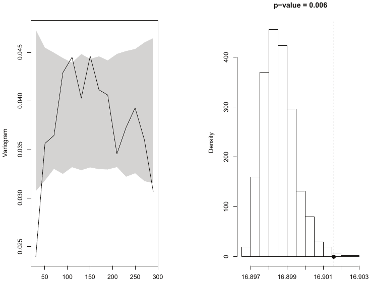
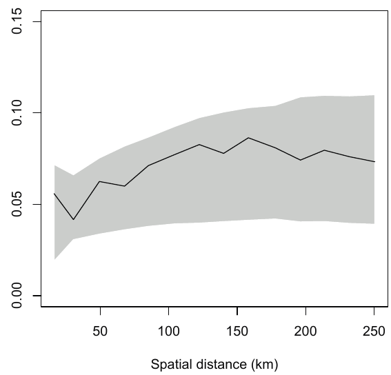
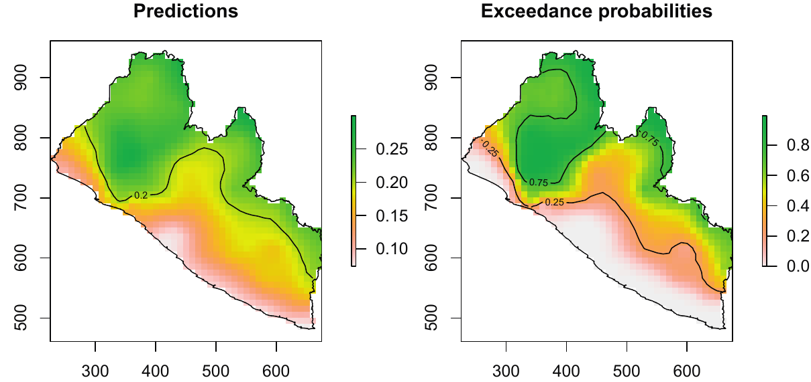

```{r setup, include=FALSE}
options(htmltools.dir.version = FALSE)
knitr::opts_chunk$set(cache = T)
```

# The linear geostatistical model

$$Y_i=d(x_i)^{\text{T}}\beta +S(x_i) + Z_i:i=1,\ldots,n$$

--
$Y_i$ observation at location $x_i$

--

$d(x_i)$ is a set of spatially indexed covariates

--

$S(x_i)$ spatial Gaussian process

- stationary and isotropic
- $Cov\{S(x), S(x^{\prime})\}=\sigma^2\rho(u;\phi)$

--

$Z_i$ uncorrelated $N(0, \tau^2)$

--

### .red[Assumption] 

Conditional on $S$, the $Y_i$ are .red[mutually independent]
$$[Y_i\mid S]\sim N(\alpha + d(x_i)^{\text{T}}\beta +S(x_i),\tau^2)$$
---
# The binomial geostatistical model

**Prevalence data**
- $x_i =$ location of a village/school/community/household
- $n_i =$ total number of sampled individuals
- $y_i =$ total number of positives

--

### .red[Assumption] 
- $Y_i\mid S(x_i), Z_i$ are .red[mutually independent] $\text{Binomial}(n_i,p(x_i))$ such that

$$\log\left\{\frac{p(x_i)}{1 - p(x_i)}\right\}=d(x_i)^{\text{T}}\beta +S(x_i) + Z_i:i=1,\ldots,n$$

---
# The Poisson geostatistical model

Appropiate to model the number of cases of a rare disease in a large population.

--

Poisson distribution with mean $\mu = np$ approximates a binomial distribution in which the number of trials, $n$, is large and the probability of success, $p$, is small.

--

### .red[Assumption] 
- $Y_i\mid S(x_i), Z_i$ are .red[mutually independent] $\text{Poisson}(\lambda(x_i))$ such that

$$\log\left\{\lambda(x_i)\right\}=d(x_i)^{\text{T}}\beta +S(x_i) + Z_i:i=1,\ldots,n$$
---
class: inverse, center, middle

# Inference

---
# Likelihood 

**The likelihood function** of a statistical model is the joint probability distribution of the data considered as a function of the parameters.

--

It follows that, if we start from our hierarchical specification of our model 
$$[Y, S; \theta]=[Y\mid S; \theta][S; \theta]$$
the likelihood can be obtained by integrating out the process $S$

$$L(\theta)=\int[Y\mid S; \theta][S; \theta]dS$$
--
No closed form is available for $L(\theta)$ under the Binomial and Poisson model.

---
# Monte Carlo Maximum Likelihood

$$
\begin{eqnarray*}
L(\theta) & = & \int[S;\theta][y\mid S]dS\\
 & = & \int[S;\theta][y\mid S]\frac{[S,y;\theta_{0}]}{[S,y;\theta_{0}]}dS\\
 & = & \int\frac{[S;\theta][y\mid S]}{[S;\theta_{0}][y\mid S]}[S,y;\theta_{0}]dS\\
 & \propto & \int\frac{[S;\theta]}{[S;\theta_{0}]}[S\mid y;\theta_{0}]dS\\
 & = & E\left\{\frac{[S;\theta]}{[S;\theta_0]}\right\}
\end{eqnarray*}
$$
with $\theta_0$ an initial guess for the value of the maximum likelihood estimate $\hat{\theta}$
---
# Monte Carlo Maximum Likelihood

1. Simulate $B$ samples, say $S_b : b = 1,\ldots,B$ from $[S\mid y;\theta_0]$

--
2. Approximate the likellihod with its Monte Carlo counterpart

$$L_{MC}(\theta)=\frac{1}{B}\sum_{j=1}^{B}\frac{[S_b;\theta]}{[S_b;\theta_0]}$$

--

- we use Markov Chain Monte Carlo (MCMC) to sample from $[S\mid y;\theta_0]$

--
-  the quality of the approximation depends on how close $\theta_0$ is to $\hat{\theta}$.

---
class: inverse, center, middle

# Model validaiton

---
# Model validation

Monte carlo procedure to theck the validity of the .red[fitted functional form for the spatial correlation].

--

1. Obtain maximul likelihood estimate of $\theta$

--
2. Simulate the Gaussian process $S(x_i)$ and the Gaussian noise $U_i$ at each of the observed locations $x_i:i=1,\ldots,n$

--
3. Simulate $Y_i:i=1,\ldots,n$ as independent realisations of a generalised linear model with linear predictor $\eta_i = d(x_i)^T\beta + S(x_i) + Z_i$ 

--
4. Compute the residuals $\hat{Z}_i:i=1,\ldots,n$ from the non-spatial GLMM fitted to the simulated $Y_i$ using $d(x_i)$ as covariates

--
5. Compute the variogram, $\hat{V}_1(u)$, based on $\hat{Z}_i$

--
6. Repeat steps 2 to 5 a large number of times, say $B$, to give variograms $\hat{V}_b(u):b=1,\ldots,B$

---
# Model validation

Calculate $\hat{V}_0(u)$, the empirical variogram of the residuals from a non-spatial GLMM fitted to the observed data.

--

If $\hat{V}_0(u)$ falls within the spread of the simulated $\hat{V}_b(u):b=1,\ldots,B$
this indicates compatibility between model and data. 

--

**95% point-wise tolerance band** 
- order the $\hat{V}_b(u):b=1,\ldots,B$ at each distance $u$
- discard the lowest and highest 2.5% of the $\hat{V}_b(u)$.

---
class: inverse, center, middle

# Applications

---
# River-blindness in Liberia

**THE DISEASE**<br/>
River-blindness or onchocerciasis is a parasitic infection transmitted by the bite of an infected blackfly

**THE DATA**<br/>
90 surveys conducted in Liberia where 40 to 50 individuals per village were tested for river-blindness
- $x_i =$ village location
- $n_i =$ number of people tested
- $y_i =$ number of individuals positively diagnosed with river-blindse

---
# Exploratory analysis

```{r map, echo=FALSE, fig.align='center', message=FALSE, warning=FALSE}
library(sf)
library(tmap)
oncho <- readr::read_csv("../data/LiberiaRemoData.csv")
oncho$prev <- oncho$npos / oncho$ntest 
oncho$prev100 <- oncho$prev * 100
oncho_sp <- oncho %>% 
  st_as_sf(coords = c("long", "lat"), crs = 4326)

liberia <- st_read("../data/geodata/gadm36_LBR.gpkg", layer = "gadm36_LBR_0", quiet = T)

map <- tm_shape(oncho_sp) +
  tm_symbols(col = "prev100", palette = "-RdYlBu", title.col = "Prevalence (%)",
             size = .3, shape = 21, border.col = "black") +
tm_layout(frame = F, legend.bg.color = "white", legend.frame = "black")
tmap_mode("view")
map
```

---
# Assessing residual spatial correlation

We first fit the following non-spatial binomial mixed model
$$\log\left\{\frac{p(x_i)}{1 - p(x_i)}\right\}=\beta_0 + \beta_1x_{i,1}+\beta_2x_{i,2} + Z_i$$
--
We calculate the empirical variogram on the estimated residuals $\hat{Z}_i$

---
# Assessing residual spatial correlation

```{r variog, echo=F, fig.align='center', out.width="80%"}

```

---
# Fitting a binomial geostatistical model

To control for the residual spatial correlation we fit the following model:

$$\log\left\{\frac{p(x_i)}{1 - p(x_i)}\right\}=\beta_0 + \beta_1x_{i,1}+\beta_2x_{i,2} + S(x_i) + Z_i$$

The estimated spatial range is $67$ km.

---
# Model assesment

```{r assesment, echo=F, fig.align='center', out.width="70%"}

```

---
# Predictions
The prediction targe of interest in this case is the probability of exceeding 20% river-blindness prevalence

```{r prediction, echo=F, fig.align='center', out.width="100%"}

```
