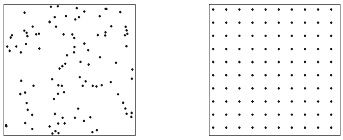
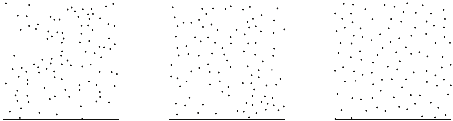
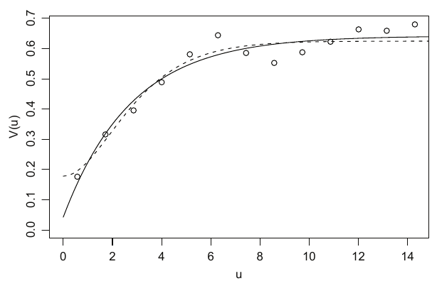
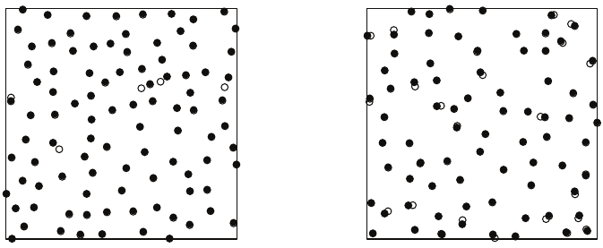
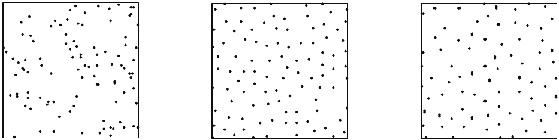
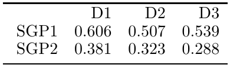
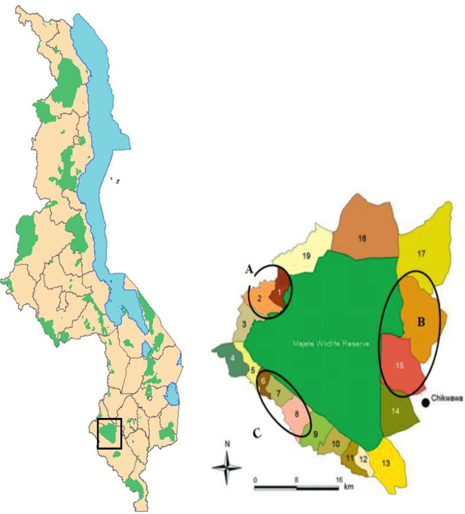
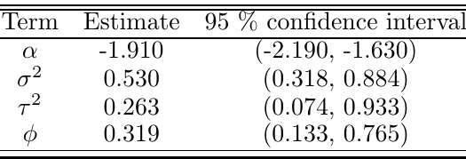
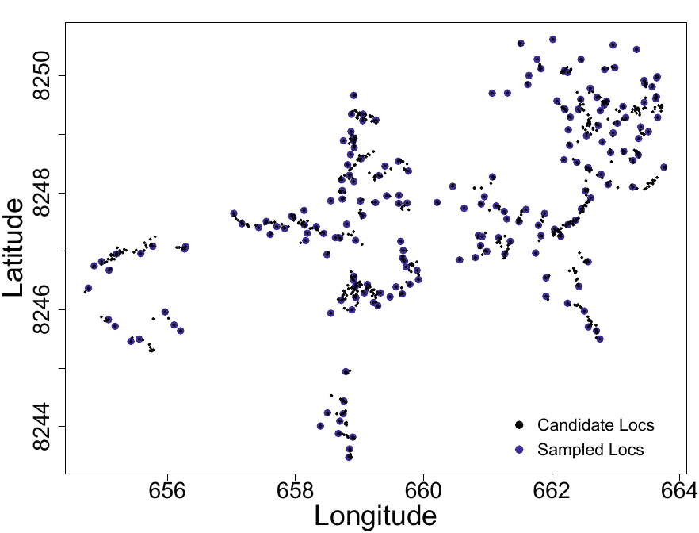

```{r setup, include=FALSE}
options(htmltools.dir.version = FALSE)
knitr::opts_chunk$set(cache = T)
```

# Introduction

- **Classical design:** focus on the sample size, how much data to collect.

- **Geoistatistical design:** focus on .red[where] to take measurements.

---

# Geostatistical design

- $\mathcal{X}=\{x_1, \ldots, x_n\}$ is the set of $n$ locations at which the outcome
variable will be recorded


- $\mathcal{X}$ is our .red[sampling design]


The fundamental geostatistical edisng problem is the specification of $\mathcal{X}$

--

<br/>

We always need to start from an .red[underlying model]:
$$Y_i = \mu + S(x_i) + Z_i$$


- $S(x)$ is a stationary, Gaussian process with mean 0, variance $\sigma^2$ and
correlation function $\rho(u; \phi)$
- $Z_i$ are mutually independent $\text{N}(0, \tau^2)$

---
# Estimation vs. prediction

In general, sampling designs that are efficient for parameter estimation
may be inefficient for prediction, and vice versa. 

--

In practice, most geostatistical problems focus on spatial prediction, but parameter
estimation is an important means to this end. 

--

Need to compromise between designing for .red[efficient parameter estimation] and designing for .red[efficient prediction]

--

The spatial covariance structure of the process $S(x)$ plays a critical role in this compromise.

---
# Performance criteria

A sampling design  should be chosen to optimise a .red[performance criterion]
that reflects the particular objective of the study.

--

**Prediction** 
<br/>
Spatially averaged mean squared prediction error 
$$\text{MSPE}=\int_AE\left[\left\{\hat{S}(x)-S(x)\right\}^2\right]dx$$
where $\hat{S}(x)=E[S(x)\mid Y;\mathcal{X}]$ 

--

**Policy relevant**
<br/>
When the measurement exceeds a policy-defined threshold for intervention, let's say $t$
$$\int_A\mid\text{Prob}\{\hat{Y}(x) > t \mid Y \} -0.5\mid dx$$
this criterion favors sampling designs that minimise the decision uncertainty.

---
# .font90[Completely random  and regular designs]

Completely .red[random] designs usually a good choice for unbiased parameter
estimation...
<br/>
...but less attrictive for prediction is .red[spatial varion] is present.

Completely .red[regular] designs generally lead to efficient spatial prediction.

<br/>

```{r random_regular, echo=F, fig.align='center', out.width="95%"}

```

---
# Inhibitory designs

A good compromise between a completely random and a completely regular design. 

A .red[minimum permissible distance] $d_0$ is imposed between any two points but the process is otherwise completely random.

The resulting designs exhibit a degree of spatial regularity without the deterministic geometry of a lattice design. 

<br/>

```{r inhibitory, echo=F, fig.align='center', out.width="95%"}

```

---
# Variogram and prediction

A critical consideration in geostatistical prediction is the behaviour of the
variogram, $V(u)$, at small distances $u$

$$V(u)=\tau^2 + \sigma^2\{1 - \rho(u)\}$$

$u=0 \rightarrow \rho(0)=1 \rightarrow V(u) = \tau^2$

- The predicted values of the surface $S(x)$ interpolate the data if $\tau^2=0$. Otherwise, they smooth out local fluctuations in the data to an extent that depends on the ratio $\tau^2 / \sigma^2$

- $\tau^2$ can be directly estimate from independent measurements of $Y$ at the same location

- if the data does not contain multiple co-located measurements, estimation of $\tau^2$ necessarily involves extrapolation.

---
# Variogram and prediction

Hypothetical empirical variogram and two theoretical variograms that fit the empirical variogram equally well, but have substantially different values of $\tau^2$ and would led to materially different predictions of $S(x)$.

```{r vario_desing, echo=F, fig.align='center', out.width="65%"}

```

---
# Inhibitory plus close pairs designs

An inhibitory design is augmented by the inclusion of locations paired with, and in close proximity to, a sub-set of locations in the inhibitory design.

A design in this class is defined by four quantities: 
- $n$ the total number of points; 
- $k$ the number of close pairs; 
- $d_0$ the minimum distance between any two of the $n − k$ locations in the inhibitory component of the design; 
- $r$ the maximum distance between two paired locations.

```{r inpcp, echo=F, fig.align='center', out.width="75%"}

```

---
# Comparing designs

**Data generating model**
<br/>
$$Y_i = \mu + S(x_i) + Z_i$$
with $\mu = 0$, $~\sigma^2=1$, $~\tau^2=0$ and $\rho(u)=\exp(-u/\phi)$

.red[SGP1] $~\phi=0.1$ and .red[SGP2] $~\phi=0.2$ 

--

<br/>

**Sampling designs**
<br/>
Three designs, each with $n=100$ points sampled on the unit square
- .red[D1] a completely random design
- .red[D2] a simple inhibitory design
- .red[D3] an inhibitory-plus-close pairs design with 80 inhibitory points and
20 close pairs


---
# Comparing designs

```{r designs, echo=F, fig.align='center', out.width="95%"}

```

<br/>

The preformance criterion used to compare the three designs is the .red[spatially averaged mean squared prediction error]. 

```{r tab_designs, echo=F, fig.align='center', out.width="45%"}

```

---
class: inverse, center, middle

# Application

---
# Malaria prevalence survey in Malawi

**Goal:** obtain optimal predictions of malaria prevalence in Majete

```{r majete, echo=F, fig.align='center', out.width="58%"}

```

---
# Underlying model

$$\log\left\{\frac{p(x_i)}{1-p(x_i)}\right\}=\alpha+S(x_i)+Z_i$$

Model was fitted using previously collected prevalence data from a sample of households in area B. 

```{r table_majete, echo=F, fig.align='center', out.width="60%"}

```

---
# Sampling design

Parameter estimates used to optimize a sample of 200 households from the 857 candidates in sub-area A, with optimisation criterion the sum of the mean squared prediction errors for
$S(x)$ at all 857 household locations:

$$\text{SSPE}=\sum_{i=1}^{857}E[\{\hat{S}(x) - S(x)\}^2]$$

```{r design_majete, echo=F, fig.align='center', out.width="60%"}

```
